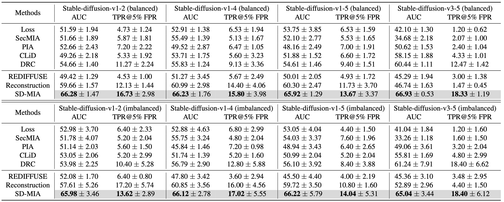

# SD-MIA

<div align="center">

### Black-box Membership Inference Attacks on the Pre-training Data of Image-generation Models

**CVPR 2026 Award Candidate**

[](#)
[](#)
[](#environment)

Tao Qi* · Huili Wang*† · Yuanhong Huang* · Wendan Wang · Lianchao Zhao · Jinrui Wang · Zichen Qin · Shangguang Wang · Yongfeng Huang

Beijing University of Posts and Telecommunications · Tsinghua University

</div>

---

SD-MIA is a **fully black-box** membership inference attack for auditing whether image-text pairs were used to pre-train text-to-image generation models.

<p align="center">
  
</p>

## Highlights

- Black-box attack: only generated images are required.
- Designed for **pre-training data**, not fine-tuning data.
- Uses token-view, style-view, and semantic-view text perturbations.
- Evaluated on Stable Diffusion v1.2/v1.4/v1.5/v3.5 and closed-source models.

## Results

<p align="center">
  
</p>

<p align="center">
  
  
</p>

## Environment

```bash
conda create -n sdmia python=3.10
conda activate sdmia
pip install -r requirements.txt
```

## Data Format

```json
[
  {
    "path": "/path/to/image.jpg",
    "caption": "a short image description",
    "label": 1
  }
]
```

## Quick Start

### 1. Generate Text Perturbations

```bash
export OPENAI_API_KEY=<your-api-key>

python src/perturb_captions_gpt.py \
  --input data/original.json \
  --output data/token_view.json \
  --model <chat-model-name> \
  --perturbation_type token_view_perturbation

python src/perturb_captions_gpt.py \
  --input data/original.json \
  --output data/style_view.json \
  --model <chat-model-name> \
  --perturbation_type style_view_perturbation

python src/perturb_captions_gpt.py \
  --input data/original.json \
  --output data/semantic_view.json \
  --model <chat-model-name> \
  --perturbation_type semantic_view_perturbation
```

### 2. Run Reconstruction and Relevance Scoring

Edit paths in `scripts/pipeline.sh`, then run:

```bash
bash scripts/pipeline.sh
```

### 3. Pool Scores

Use `process.ipynb` to aggregate `attack_results.json` and compute final membership scores.

## Citation

```bibtex
@inproceedings{qi2026sdmia,
  title     = {Black-box Membership Inference Attacks on the Pre-training Data of Image-generation Models},
  author    = {Qi, Tao and Wang, Huili and Huang, Yuanhong and Wang, Wendan and Zhao, Lianchao and Wang, Jinrui and Qin, Zichen and Wang, Shangguang and Huang, Yongfeng},
  booktitle = {Proceedings of the IEEE/CVF Conference on Computer Vision and Pattern Recognition},
  year      = {2026}
}
```
